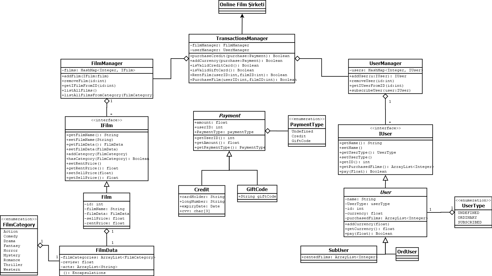
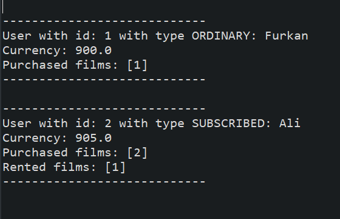

# ***OnlineFilmSirketi***

<p>&nbsp;</p>


I tried to write the code of uml in my homework via Java☕ [Click to go to homework](https://github.com/furkanaliunal/PatikaDevOOP#-%C3%B6dev-4---online-film-sitesi)

---

🔶🔷💠🔷🔶

I used Enumeration, Encapsulation, Inheritance, Polymorphism, Abstraction and Java101 in this project


This is my one day challange project to study and I am a beginner so I think my code is good but It might not be. 😅

Trying to improve my experience

Please let me know what do you think about this project. 🙏🏻  
 

🔶🔷💠🔷🔶





<p>&nbsp;</p>
<p>&nbsp;</p>

---

>Main class is [com/os/OnlineFilmSirketi.java](https://github.com/furkanaliunal/PatikaOOP-OnlineFilmSirketi-in-Java-/blob/main/src/com/os/OnlineFilmSirketi.java)

---

<p>&nbsp;</p>

---

## How to run:
This project doesn't use maven or gradle. 
To run it. Copy the classes in a new java project and then run the main class 

---

<p>&nbsp;</p>
<p>&nbsp;</p>
<p>&nbsp;</p>

>Initalizing managers
```java
    public static void initalizingManagers() {
		userManager = new UserManager();
		filmManager = new FilmManager();
		transManager = new TransactionsManager(filmManager, userManager);//requires both managers
    }
```

>Adding users to list
```java
    public static void addingUsers() {
		
		userManager.addUser(new OrdUser("Furkan"));
		userManager.addUser(new SubUser("Ali"));
		userManager.addUser(new DefUser("Fatma", UserType.SUBSCRIBED));//DefUser is just for testing purposes
    }
```

>Adding films to list
```java
    public static void addingFilms() {

		filmManager.addFilm(new Film("Interstellar"));
		filmManager.addFilm(new Film("Pirates"));
		filmManager.addFilm(new Film("Akame kill"));
		filmManager.addFilm(new Film("Avengers"));
	}
```

>Adding categories to films
```java
    public static void addingCategories() {
        Film f = new Film("Transformers");
		f.addCategory(FilmCategory.Action);//now Film has Action category
		filmManager.addFilm(f);//new film object is added to list


        //Retrieving a film from list and then adding to it a category
        IFilm film = filmManager.getFilmFromID(1);
		film.addCategory(FilmCategory.Action);
		film.addCategory(FilmCategory.Comedy);
	}
```

>Retrieving users from list
```java
    public static void retrievingUsers() {
		
		Iterator<IUser> it = userManager.getAllUsers().iterator();
		while(it.hasNext()) {
			IUser u = it.next();
			System.out.println(u.toString());//Printing all users
		}
		
		
		IUser u = userManager.getIUserFromID(1);//Retrieving user with ID 1
		System.out.println(u.getID()+ ":"+ u.getName());
	}
```

>Retrieving films from list
```java
    public static void retrievingFilms() {
			filmManager.listAllFilms();//Printing all films in the list

			System.out.println("Films with category Action");//Printing all films from a category
			filmManager.listAllFilmsFromCategory(FilmCategory.Action);

            IFilm film = filmManager.getIFilmFromID(1);//Getting film from id

            
			Collection<IFilm> films = filmManager.getAllUsers();//All films from the list an object
	}
```

>Transactions
```java
    public static void transactions() {
		transManager.PurchaseCredit(new GiftCode("happy-new-year-1500", 1000, 1));//1000 Credit has been added to user with id 1
		transManager.PurchaseCredit(new GiftCode("happy-new-year-1500", 1000, 2));
		
		IUser user1 = userManager.getIUserFromID(1);
		IUser user2 = (SubUser)userManager.getIUserFromID(2);//subscribed one
		IFilm film1 = filmManager.getFilmFromID(1);
		film1.setSellPrice(100f);//Setting the price for a film
		film1.setRentPrice(10f);
		filmManager.getFilmFromID(2).setSellPrice(85f);
		
		transManager.PurchaseFilm(user1.getID(), film1.getFilmID()); //User with id 1 bought a film

		transManager.PurchaseFilm(user2.getID(), 2);//User with id 2 bought a film

		transManager.RentFilm(user2.getID(), 1);//User with id 1 rented a film

		System.out.println(user1.toStringDetailed());//Printing account details
		System.out.println(user2.toStringDetailed());
	}
```

